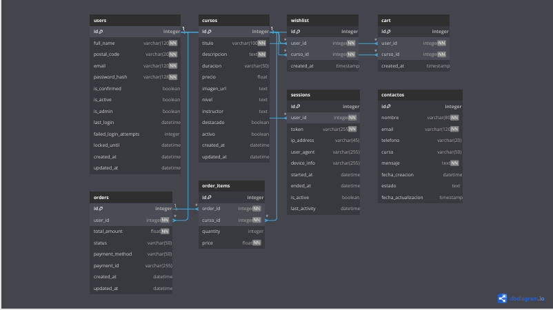

# Backend de Akademia Kupula

Este es el backend para la aplicación web **Akademia Kupula**, desarrollado con Flask.

## Características

- API RESTful para la gestión de cursos, usuarios, pedidos y contactos
- Autenticación segura con JWT (JSON Web Tokens)
- Base de datos SQLite (fácilmente configurable para PostgreSQL en producción)
- Optimización de rendimiento con caché y compresión
- Seguridad mejorada: rate limiting, cabeceras seguras y protección contra ataques comunes
- Soporte para pagos con Stripe
- Gestión de sesiones y administración avanzada

## Requisitos

- Python 3.9+
- Pip (gestor de paquetes de Python)
- Entorno virtual (recomendado)

## Instalación

1. **Clonar el repositorio:**
   ```bash
   git clone https://github.com/tu-usuario/Flask-akademiaKupula.git
   cd Flask-akademiaKupula
   ```

2. **Crear y activar un entorno virtual:**
   ```bash
   # En Windows
   python -m venv venv
   venv\Scripts\activate

   # En macOS/Linux
   python3 -m venv venv
   source venv/bin/activate
   ```

3. **Instalar dependencias:**
   ```bash
   pip install -r requirements.txt
   ```

4. **Configurar variables de entorno:**
   - Crea un archivo `.env` en la raíz del proyecto con las siguientes variables:
   ```
   FLASK_ENV=development
   FLASK_DEBUG=True
   SECRET_KEY=tu-clave-secreta
   JWT_SECRET_KEY=tu-clave-jwt-secreta
   SQLALCHEMY_DATABASE_URI=sqlite:///akademiakupula.db

   # Configuración de correo (opcional)
   MAIL_SERVER=smtp.gmail.com
   MAIL_PORT=587
   MAIL_USE_TLS=True
   MAIL_USERNAME=tu-email@gmail.com
   MAIL_PASSWORD=tu-contraseña
   MAIL_DEFAULT_SENDER=tu-email@gmail.com

   # Stripe (opcional)
   STRIPE_SECRET_KEY=sk_test_xxx
   STRIPE_WEBHOOK_SECRET=whsec_xxx
   ```

5.1 **Inicializar la base de datos:**
   ```bash
   flask db init
   flask db migrate -m "Initial migration"
   flask db upgrade
   ```
5.2 **vista y relaciones de la base de datos


## Ejecución

Para ejecutar el servidor en modo desarrollo:

```bash
flask run
```

O alternativamente:

```bash
python run.py
```

El servidor estará disponible en [http://localhost:5000](http://localhost:5000).

## Estructura del Proyecto

```
Flask-akademiaKupula/
├── app/                    # Paquete principal de la aplicación
│   ├── models/             # Modelos de datos
│   ├── routes/             # Rutas de la API
│   ├── __init__.py         # Inicialización de la aplicación
│   └── utils.py            # Utilidades
├── migrations/             # Migraciones de la base de datos
├── instance/               # Datos de la instancia (base de datos)
├── .env                    # Variables de entorno
├── config.py               # Configuración de la aplicación
├── requirements.txt        # Dependencias
├── run.py                  # Punto de entrada
└── README.md               # Este archivo
```

## API Endpoints

### Autenticación

- `POST /api/auth/register` — Registro de usuario
- `POST /api/auth/login` — Inicio de sesión
- `GET /api/auth/profile` — Perfil de usuario (requiere autenticación)
- `POST /api/auth/refresh` — Refrescar token de acceso
- `POST /api/auth/logout` — Cerrar sesión

### Cursos

- `GET /api/cursos` — Obtener todos los cursos
- `GET /api/cursos/<id>` — Obtener un curso específico
- `POST /api/cursos` — Crear un nuevo curso (requiere autenticación)
- `PUT /api/cursos/<id>` — Actualizar un curso (requiere autenticación)
- `DELETE /api/cursos/<id>` — Eliminar un curso (requiere autenticación)

### Contacto

- `POST /api/contacto` — Enviar un mensaje de contacto
- `GET /api/contacto` — Obtener todos los mensajes (requiere autenticación)

### Administración

- `GET /api/admin/dashboard` — Estadísticas generales (requiere admin)
- `GET /api/admin/users` — Listar usuarios (requiere admin)
- `GET /api/admin/users/<id>` — Ver usuario (requiere admin)
- `PUT /api/admin/users/<id>` — Actualizar usuario (requiere admin)
- `DELETE /api/admin/users/<id>` — Eliminar usuario (requiere admin)
- `GET /api/admin/contacts` — Listar mensajes de contacto (requiere admin)
- `GET /api/admin/orders` — Listar pedidos (requiere admin)
- `GET /api/admin/sessions` — Listar sesiones de usuarios (requiere admin)

### Pagos

- `POST /api/payment/create-checkout-session` — Crear sesión de pago Stripe (requiere autenticación)
- `POST /api/payment/webhook` — Webhook de Stripe
- `GET /api/payment/check-payment-status/<session_id>` — Verificar estado de pago (requiere autenticación)
- `GET /api/payment/history` — Historial de pagos del usuario (requiere autenticación)

### Sesiones de usuario

- `GET /api/sessions/` — Listar sesiones activas del usuario (requiere autenticación)
- `GET /api/sessions/current` — Obtener la sesión actual (requiere autenticación)
- `DELETE /api/sessions/<session_id>` — Cerrar una sesión específica (requiere autenticación)
- `DELETE /api/sessions/all` — Cerrar todas las sesiones excepto la actual (requiere autenticación)

### Carrito y lista de deseos

- `GET /api/user_courses/wishlist` — Obtener lista de deseos (requiere autenticación)
- `POST /api/user_courses/wishlist` — Añadir a la lista de deseos (requiere autenticación)
- `DELETE /api/user_courses/wishlist/<curso_id>` — Eliminar de la lista de deseos (requiere autenticación)
- `GET /api/user_courses/cart` — Obtener carrito (requiere autenticación)
- `POST /api/user_courses/cart` — Añadir al carrito (requiere autenticación)
- `DELETE /api/user_courses/cart/<curso_id>` — Eliminar del carrito (requiere autenticación)

## Optimizaciones Implementadas

1. **Caché**: Se utiliza Flask-Caching para almacenar en caché resultados de consultas frecuentes.
2. **Compresión**: Se comprime el contenido de las respuestas para reducir el tamaño de transferencia.
3. **Rate Limiting**: Se limita la cantidad de solicitudes por IP para prevenir abusos.
4. **Seguridad**: Se implementan cabeceras de seguridad y protección contra ataques comunes.
5. **Rendimiento de Base de Datos**: Se utilizan índices y consultas optimizadas.

## Contribución

¡Las contribuciones son bienvenidas! Por favor, abre un issue o pull request para sugerencias o mejoras.

## Autor

- [silvia76-max]

---

¡Gracias por usar React-akademiaKupula!

## Licencia

Este proyecto está licenciado bajo la Licencia MIT. Consulta el archivo LICENSE para más detalles.


